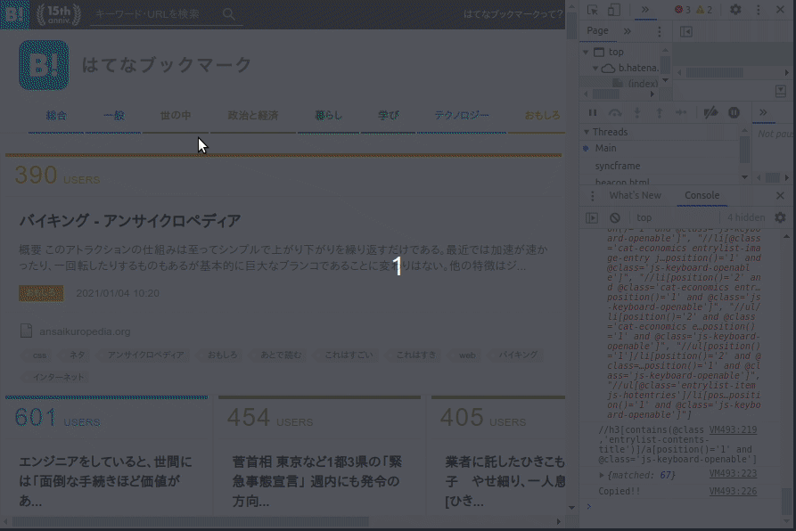

# XPath generator by example

要素をマウスで複数選択することで、それらの要素すべてを含むxpathを生成する。

## 使い方
* コンパイルした xpath_gen.js をChromeのdeveloper toolのConsoleに貼り付ける
* マウスを要素の上に置いて、Aキーを押して選択（背景色が赤に変化）
* 他の要素で同様にAキーを押す。すると、2つの要素を含む共通のXPATHが生成される（consoleに出力、背景色が青に変化）
  * 同時に、要素のinnerTextが改行区切りでクリップボードにコピーされる
* Cキーで選択解除

## 参考
* XPath生成のアルゴリズムを利用
  * https://chrome.google.com/webstore/detail/xpath-generator/dphfifdfpfabhbkghlmnkkdghbmocfeb
* 考え方を利用
  * https://en.wikipedia.org/wiki/Programming_by_example

## 問題点
* 少なくとも一つ要素が一意に定まるXPathが生成されるはずだが、一意にならない場合があるので、うまく動かない場合がある。
* 細かく要素がマウスでポイントできない場合の対応や、テキストの中も見る。
* 使いづらいのでブックマークレットや拡張機能にしたい。
* アルゴリズムを変更
  * 反例を扱えるように
  * 見る属性を自動的に判断